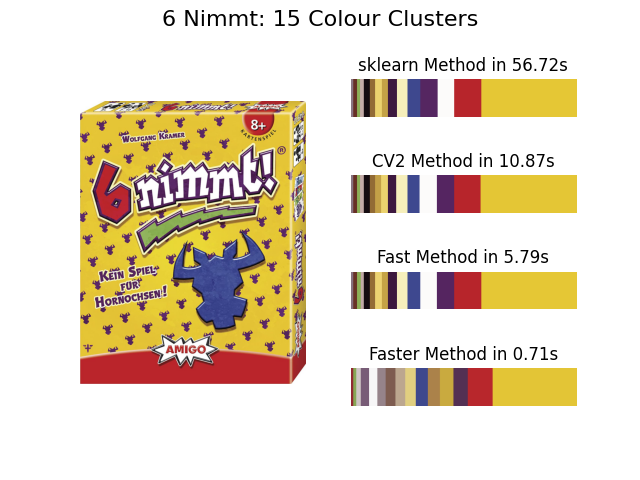

# dominant-colour

A comparison of different k-means clustering methods in python for getting the dominant colour of an image.

To run the example: `python run.py`

For more info, [read my blog post](https://tinkertailorsoldiersponge.com/blog/dominant-colour-extraction-in-python)

Example result:

